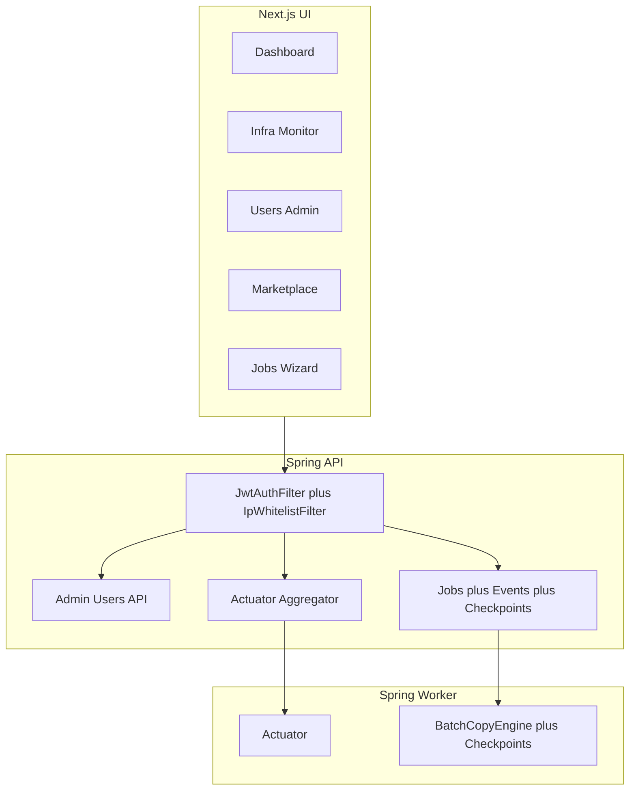

# Platform Admin & Ops Mega Plan

> **For agentic workers:** REQUIRED SUB-SKILL: Use superpowers:subagent-driven-development (recommended) or superpowers:executing-plans to implement this plan task-by-task.

**Goal:** Give operators full dashboard control — users, settings without restart, infra visibility, secure APIs, plug-and-play connectors, durable jobs with test-before-create, and consistent UI primitives (theme, loader, toaster, tables) — with Cursor rules so future work follows the same patterns.

**Architecture:** Spring API remains the control plane (JWT cookie + domain-admin gate). Worker gains Actuator + shared auth for metrics. Next.js is a thin authenticated UI: reusable shell primitives + paginated tables. Runtime settings stay in `app_config` (already no-restart). Sessions are JWT with a DB `token_version` for revoke. Connectors stay Maven packages on the classpath; “install” = enable row in `connector_plugins` (marketplace UI), not dynamic JAR upload in Phase 1 of this mega plan (keeps YAGNI; docs describe future Redis/MySQL packages the same way).

**Tech Stack:** Next.js 16 + shadcn/ui + Tailwind v4 tokens + next-themes; Spring Boot 3.3 Actuator/Security/JPA; Postgres; Redis queue; existing GSpace notifier.

**Locked decisions**
- Scope: full mega-plan (1D), executed task-by-task via subagents
- Admins: email domain matches `ALLOWED_EMAIL_DOMAIN` (`app.auth.allowed-email-domain`); empty domain in local/dev → all authenticated users are admins
- IP whitelist: restore as **dashboard-editable** `app_config` keys applied by a Spring filter (no restart); ALB/K8s remains network edge
- Connector “install”: enable/disable in DB + classpath plugin already present; remove marketplace cards from `/dashboard` (keep `/connectors/marketplace`)

## Global Constraints

- Reuse/enhance existing components before adding new ones (`StatCard`, `ConfigEditor`, `JobWizard`, sonner, `api-client`, `AppConfigService`)
- No new deps unless unavoidable (prefer shadcn add for missing UI)
- Every list GET is paginated (`page`, `size` 10–500)
- Without valid JWT → 401 on all non-OAuth/health endpoints
- Admin routes require domain-admin
- Update `docs/` + `CHANGELOG.md` with each major task group
- Keep debug instrumentation cleanup from prior OAuth/dashboard work as a small hygiene task
- ponytail: intentional shortcuts get a ceiling comment

---

## Task group A — UI foundation (logout, theme, primitives, rules)

**Files:** [`AppSidebar.tsx`](apps/web/src/components/layout/AppSidebar.tsx), [`AppShell.tsx`](apps/web/src/components/layout/AppShell.tsx), [`layout.tsx`](apps/web/src/app/layout.tsx), [`api-client.ts`](apps/web/src/lib/api-client.ts), [`globals.css`](apps/web/src/app/globals.css), new `.cursor/rules/ui-patterns.mdc`

1. Wire `ThemeProvider` (`next-themes`) + theme toggle in shell; color changes via CSS variables only
2. Add `logout()` in `api-client` → `POST /api/auth/logout` + redirect `/login`; user menu (shadcn DropdownMenu + Avatar) in shell
3. Add reusable `AppLoader` (Spinner/Skeleton), ensure Toaster is sole status channel; export `notify.success/error/info` wrapper around sonner
4. Add colorful pill `Button` variants (success/warning/danger/info) via CVA on existing `button.tsx`
5. Responsive shell: sidebar collapses on small screens (Sheet)
6. Create Cursor rule: always use AppLoader + notify toaster + semantic tokens + paginated tables; no raw `fetch` toasts

---

## Task group B — Security lockdown + domain admin

**Files:** [`SecurityConfig.java`](services/api/src/main/java/com/migration/security/SecurityConfig.java), [`JwtAuthFilter.java`](services/api/src/main/java/com/migration/security/JwtAuthFilter.java), [`JwtService.java`](services/api/src/main/java/com/migration/auth/JwtService.java), [`UserEntity.java`](services/api/src/main/java/com/migration/auth/UserEntity.java), new `IpWhitelistFilter`, Flyway migration

1. Flyway: `users.token_version INT`, `last_login_at`, `last_seen_at`, `revoked_at`; JWT claim `ver`
2. On each authenticated request bump `last_seen_at` (throttled); revoke = increment `token_version` + set `revoked_at`
3. Domain-admin helper: `email` ends with `@` + allowed domain (case-insensitive)
4. Restore IP whitelist filter reading `ip_whitelist_mode` / `ip_whitelist` from `AppConfigService` (hot reload); permit health/oauth only
5. Lock down Actuator to authenticated (+ admin for sensitive); remove leftover OAuth debug file writers under `.cursor/`
6. Worker: add Actuator + shared internal metrics token OR require JWT for proxied paths only via API aggregator (prefer **API aggregates worker metrics** so worker port stays private)

---

## Task group C — Users admin UI + API

**Files:** new `AdminUserController`, enhance `UserService`/`UserRepository`, new `apps/web/src/app/users/page.tsx`

1. `GET /api/admin/users?page&size` — paginated list: email, name, lastLogin, lastSeen, online (seen &lt; 5m), revoked
2. `POST /api/admin/users/{id}/revoke` — bump token_version
3. `DELETE /api/admin/users/{id}` — delete user (block self-delete)
4. UI table with page-size selector (10–500), revoke/delete actions, toasts + loader
5. Nav link **Users** (domain-admin only; hide if `/api/auth/me` says `admin:false`)
6. Extend `/api/auth/me` with `admin`, `lastLoginAt`

---

## Task group D — Dashboard redesign (clock, cards, charts, no marketplace)

**Files:** [`dashboard/page.tsx`](apps/web/src/app/dashboard/page.tsx), [`DashboardController.java`](services/api/src/main/java/com/migration/dashboard/DashboardController.java), remove [`MarketplaceSection`](apps/web/src/components/dashboard/MarketplaceSection.tsx) from home

1. Client clock: `hh:mm:ss` in browser TZ (local `Intl` / `toLocaleTimeString`)
2. Extend `/api/dashboard/stats`: registeredUsers, onlineUsers, workersOnline, workerThreads, appDbPoolActive/Max/Avg (Hikari MXBean), job/connection counts
3. Cards for CPU/RAM: from Actuator `metrics` (process.cpu.usage, jvm.memory.used) for API; worker via aggregator
4. Add shadcn Chart (line charts) for simple time series: API caches last N samples in Redis or `app_metric_samples` table (ponytail: in-memory ring buffer OK for 15m window if documented)
5. Remove marketplace section from dashboard; keep marketplace route

---

## Task group E — Infra monitor page

**Files:** new `/infra` page, new `InfraController` aggregating Actuator

1. API: `GET /api/admin/infra` → API health/info/metrics + worker health/metrics (HTTP to worker localhost/service URL from config)
2. Next.js: show build version / node env from a tiny authenticated BFF route or static build id; document limits of browser-side visibility
3. UI cards: API / Worker / Web status, pool usage, threads, uptime
4. Secure: admin-only

---

## Task group F — Pagination everywhere + data tables

**Files:** Job/Connection/Worker controllers + list pages

1. Shared `PageResponse<T>{content,page,size,totalElements,totalPages}`
2. Convert `GET /api/jobs`, `/connections`, `/workers`, `/admin/users` to `page`/`size` (default 20, max 500)
3. Reusable `DataTable` + `PageSizeSelect` (10–500) on UI lists

---

## Task group G — Connectors marketplace install + connection form

**Files:** [`MarketplaceController`](services/api/src/main/java/com/migration/connectors/MarketplaceController.java), [`ConnectionForm.tsx`](apps/web/src/components/connectors/ConnectionForm.tsx), docs [`adding-a-connector.md`](docs/connectors/adding-a-connector.md)

1. `POST /api/marketplace/{pluginId}/install` → set `enabled=true` if classpath plugin exists; `uninstall` → `enabled=false` (block if connections reference it)
2. Connection create: select installed connector first; fields from plugin `configFields` (dynamic)
3. Add `minPoolSize`/`maxPoolSize` (default max 10) on connection config JSON; connector pool managed per connection handle
4. Document Redis/MySQL future packages: same SDK interface + Flyway seed + install enable

---

## Task group H — Durable job state + logging

**Files:** worker `BatchCopyEngine` / `HotColdManager`, new checkpoint entity, `JobEvent` writes from worker

1. Persist checkpoints to `job_checkpoints` on each batch; resume from last cursor on start/resume
2. Worker writes COMPLETED/FAILED/PROGRESS events to DB (not memory-only)
3. On worker restart: reclaim RUNNING jobs stuck with stale heartbeat → re-queue or FAIL with GSpace alert
4. Docs: correct [`worker.md`](docs/components/worker.md) checkpoint claims

---

## Task group I — Dynamic job form + live test job stream

**Files:** [`JobWizard.tsx`](apps/web/src/components/jobs/JobWizard.tsx), new test endpoints + `LiveLogTerminal` component

1. Source/dest connections → schema/table pickers (already partial); require both
2. `POST /api/jobs/test` starts sandboxed test: `SELECT 1` both DBs → copy N test rows → stream logs via SSE
3. Reusable `LiveLogTerminal` component for streaming lines
4. On pass: toast + Alert to delete/truncate test rows before create; Enable **Add job** only after pass
5. Colorful action buttons (Test / Add / Cancel)

---

## Task group J — GSpace alerts for lifecycle + exceptions

**Files:** [`GspaceNotifier.java`](services/api/src/main/java/com/migration/notifications/GspaceNotifier.java), worker notify path

1. Unify webhook resolution: job override → settings `gspace_webhook_url` → env
2. Structured cards: job id, phase, error class/message, stack snippet, worker id, timestamp
3. Fire on job FAILED + uncaught worker/API exception handler (admin webhook)
4. Wire progress interval if configured (or document defer if YAGNI — prefer wire minimal progress every N minutes)

---

## Task group K — Docs + changelog + hygiene

1. Update `docs/architecture.md`, `configuration.md`, `frontend.md`, `api.md`, `worker.md`, `marketplace.md`, `CHANGELOG.md`
2. Remove OAuth/dashboard debug NDJSON writers
3. `.env.example`: `ADMIN` notes (domain = admin), pool defaults, worker metrics URL

---

## Execution order (subagent-driven)

Execute **A → B → C → D → E → F → G → H → I → J → K** (security before admin UI; primitives before pages; pagination before large tables; durable jobs before test stream).

Each task group = one or more SDD tasks with TDD where logic is non-trivial (JWT version revoke, IP filter, checkpoint resume, pagination).

## Out of scope (explicit YAGNI)

- Uploading arbitrary connector JARs at runtime
- Full Next.js process CPU from browser (build/id + client RUM only)
- Multi-tenant workspaces
