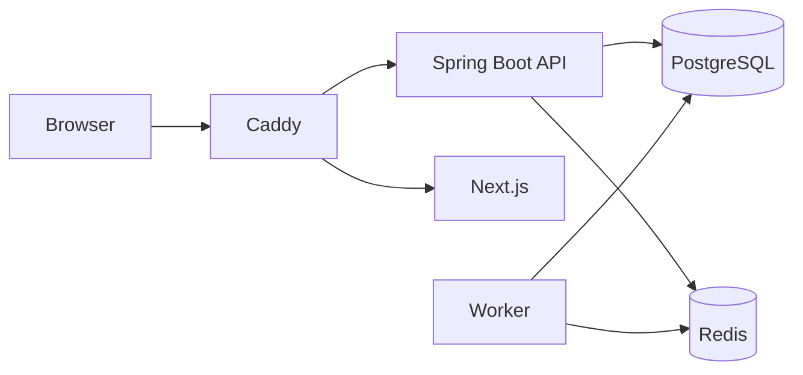

# Data Migration Platform

[](LICENSE)

Enterprise data migration platform with a Next.js dashboard, Spring Boot API/worker, and pluggable database connectors.

## Quick Start

```bash
cp .env.example .env
./run-local-dev.sh
```

Open http://localhost:3000

## Architecture



Full diagram: [docs/architecture.md](docs/architecture.md)

## Documentation

Full docs: [docs/README.md](docs/README.md)

| Guide | Description |
|---|---|
| [Development](docs/development.md) | Local dev script, flags, troubleshooting |
| [Deployment](docs/deployment.md) | Single Docker image, production compose |
| [Configuration](docs/configuration.md) | Env vs DB precedence, auth |
| [Architecture](docs/architecture.md) | System diagram, modules, data flow |
| [Marketplace](docs/marketplace.md) | Connector catalog |
| [Changelog](docs/CHANGELOG.md) | Release notes |

## Stack

- **Frontend:** Next.js 16, shadcn/ui, Tailwind CSS
- **Backend:** Spring Boot 3.3, Java 21
- **Database:** PostgreSQL (app DB + connector targets)
- **Queue:** Redis
- **Connectors:** Java ServiceLoader plugin SPI

## Project Structure

```
apps/web/           Next.js dashboard
services/api/       REST API (8080)
services/worker/    Job processor (8081)
packages/           connector-sdk, domain
connectors/         Database plugins
infra/              Docker, compose files
scripts/            run-local-dev.sh, entrypoint
docs/               Documentation
```

## Contributing

See [CONTRIBUTING.md](CONTRIBUTING.md). Security issues: [SECURITY.md](SECURITY.md).

## License

Licensed under the [Apache License, Version 2.0](LICENSE). See [NOTICE](NOTICE) for attribution.
