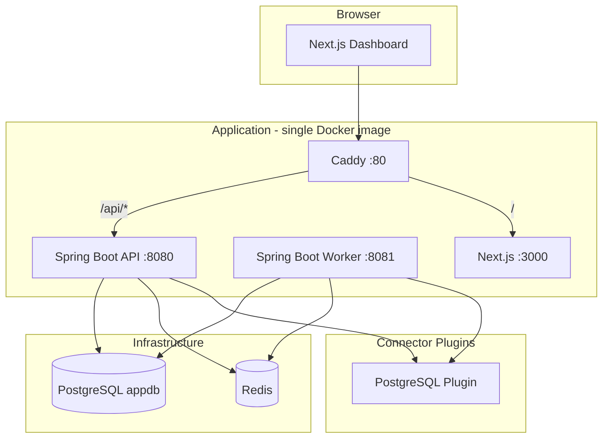
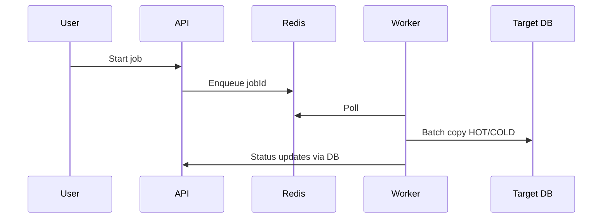

# Architecture Overview

## System Diagram

## Module Map

| Module | Path | Responsibility |
|---|---|---|
| Frontend | `apps/web/` | Dashboard, job wizard, settings, marketplace UI |
| API | `services/api/` | Auth, config, connectors, jobs, orchestration |
| Worker | `services/worker/` | Batch copy, hot/cold phases, reconciliation |
| Connector SDK | `packages/connector-sdk/` | Plugin interface, filter types |
| Domain | `packages/domain/` | Shared JPA entities, AES decrypt |
| PostgreSQL Plugin | `connectors/postgresql/` | PG introspection, batch read/write |

## Data Flow: Job Execution

1. User creates job via wizard → stored in `jobs` table
2. User clicks Start → API pushes job ID to Redis queue
3. Worker polls queue → loads source/dest connection configs (decrypted)
4. HotColdManager runs HOT then COLD phases via BatchCopyEngine
5. Checkpoints written after each batch commit
6. Reconciliation compares source vs destination counts
7. GSpace notifications on lifecycle events

## Config Storage

- **Env-only secrets:** JWT, encryption key, OAuth credentials
- **DB-backed config:** Thread limits, GSpace URL, batch size
- **Dashboard edits** persist in `app_config` with `source=DASHBOARD`

[Back to Documentation Index](README.md) | [Project README on GitHub](https://github.com/shubh-am8/data-migration-tool/blob/main/README.md)
