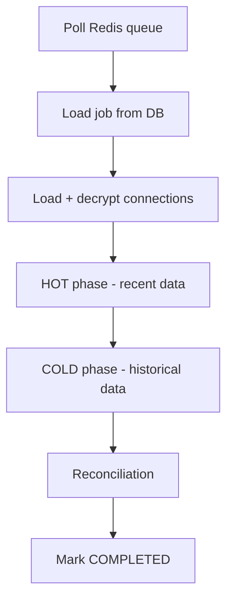

# Worker Service

Spring Boot worker on port 8081. Consumes jobs from Redis queue.

## Job Processing Flow

## Hot/Cold Phases

| Phase | Purpose | Checkpoint key |
|---|---|---|
| HOT | Recent/changed rows (configurable window) | `hot:{table}` |
| COLD | Full historical backfill | `cold:{table}` |

Each time chunk commits a `job_checkpoints` row (`batch_key` = `chunk-N` or `full`) and a `PROGRESS`/`COMPLETED`/`FAILED` row in `job_events`. Stale `RUNNING` jobs (no update for ~2 minutes) are reclaimed as `FAILED` with a GSpace alert.

Actuator: `health`, `info`, `metrics` on `:8081` (fetched by API via `WORKER_METRICS_URL`, not exposed through the public UI proxy).

## Configuration

| Env var | Default | Description |
|---|---|---|
| `REDIS_HOST` | localhost | Queue host |
| `WORKER_ID` | worker-1 | Unique worker identifier |
| `ENCRYPTION_KEY` | required | Must match API for decrypt |
| `GSPACE_WEBHOOK_URL` | | Worker lifecycle notifications |

[Back to Documentation Index](../README.md) | [Project README on GitHub](https://github.com/shubh-am8/data-migration-tool/blob/main/README.md)
