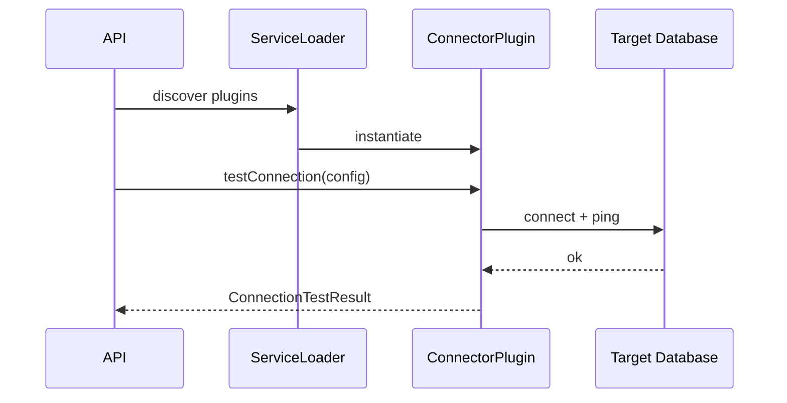

# Connectors

Connectors are pluggable database adapters implementing the `ConnectorPlugin` SPI.

## Plugin Lifecycle



## SPI Interface

```java
public interface ConnectorPlugin {
    String id();
    String name();
    String description();
    String version();
    List<ConfigField> configSchema();
    ConnectionTestResult testConnection(Map<String, String> config);
    // ... introspection, batch read/write
}
```

## Built-in Connectors

| ID | Module | Status |
|---|---|---|
| `postgresql` | `connectors/postgresql/` | Available |

## Registration

Create `META-INF/services/com.migration.connector.ConnectorPlugin` with the plugin class FQN.

See [Adding a Connector](adding-a-connector.md) for a step-by-step guide.

[Back to Documentation Index](README.md) | [Project README](../README.md)
