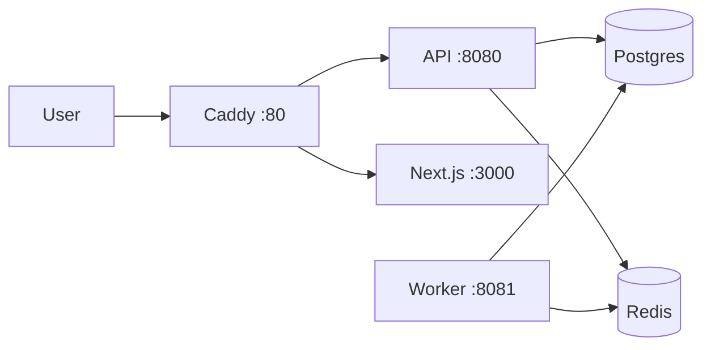
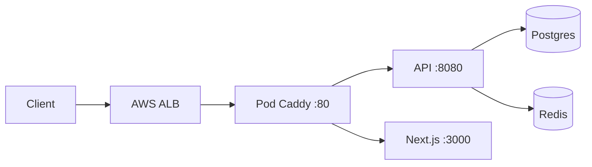

# Deployment Guide

## Single All-in-One Image

The production image bundles API, Worker, Next.js, and Caddy into one container.

```bash
docker build -f infra/Dockerfile -t migration-platform .
docker compose -f infra/docker-compose.yml up -d
```

Access: http://localhost (port 80)

## Architecture



Postgres and Redis run as separate containers in `infra/docker-compose.yml`.

## Kubernetes (AWS ALB)

The same all-in-one image runs on K8s behind an AWS Application Load Balancer. ALB terminates TLS and forwards HTTP to the pod.



Manifests: `infra/k8s/` (`deployment.yaml`, `service.yaml`, `ingress.yaml`, `configmap.yaml`).

```bash
# Build and push image, then apply (adjust image tag and secrets)
docker build -f infra/Dockerfile -t YOUR_REGISTRY/migration-platform:latest .
kubectl apply -f infra/k8s/configmap.yaml
kubectl apply -f infra/k8s/deployment.yaml
kubectl apply -f infra/k8s/service.yaml
kubectl apply -f infra/k8s/ingress.yaml
```

**Required K8s env (set in deployment or secrets):**

| Variable | K8s value | Why |
|---|---|---|
| `AUTH_COOKIE_SECURE` | `true` | Cookies over HTTPS |
| `AUTH_ENFORCED` | `true` | Require login in production |
| `FRONTEND_URL` | `https://your-host` | OAuth redirect |
| `CORS_ALLOWED_ORIGINS` | `https://your-host` | Browser API calls |

**ALB ingress:** Edit `ingress.yaml` — set `certificate-arn`, host, and `ingressClassName: alb` (requires [AWS Load Balancer Controller](https://kubernetes-sigs.github.io/aws-load-balancer-controller/)).

Network access control (IP allowlists) belongs at the infra layer — ALB security groups or AWS WAF — not in the app.

## Environment Variables

See [.env.example](../.env.example). Key production vars:

| Variable | Required | Description |
|---|---|---|
| `JWT_SECRET` | Yes | 32+ char signing key |
| `ENCRYPTION_KEY` | Yes | 32+ byte AES key for connection secrets |
| `GOOGLE_CLIENT_ID` | Yes | OAuth |
| `GOOGLE_CLIENT_SECRET` | Yes | OAuth |
| `ALLOWED_EMAIL_DOMAIN` | Yes | Restrict login to `@domain` |
| `AUTH_ENFORCED` | Yes | `true` in production |
| `AUTH_COOKIE_SECURE` | Prod HTTPS | `true` behind TLS |

## Build Notes

- Web is built with `output: standalone` for minimal runtime
- Caddy proxies `/api/`, `/oauth2/`, `/login/`, `/actuator/` to API; everything else to Next.js
- supervisord manages API, Worker, Web, and Caddy with autorestart

[Back to Documentation Index](README.md) | [Project README](../README.md)
