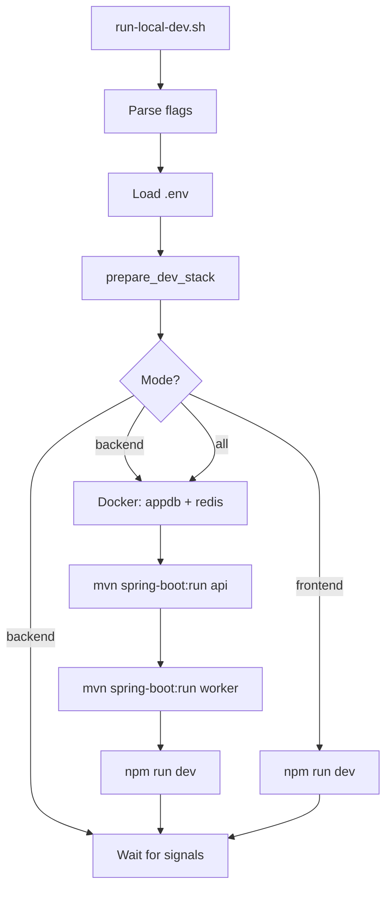

# Development Guide

## Prerequisites

- Java 21, Maven 3.9+
- Node.js 22+, npm
- Docker Desktop (for Postgres + Redis)

## Quick Start

```bash
cp .env.example .env
# Edit .env with Google OAuth credentials if needed

./run-local-dev.sh
```

Open http://localhost:3000

## Script Flags

| Command | What starts |
|---|---|
| `./run-local-dev.sh` | Postgres + Redis + API + Worker + Frontend |
| `./run-local-dev.sh --backend` | Postgres + Redis + API + Worker |
| `./run-local-dev.sh --frontend` | Frontend only (API must already run) |
| `./run-local-dev.sh --keep-infra` | On Ctrl+C, leave Postgres/Redis running |
| `./run-local-dev.sh --help` | Show usage |

## Dev Script Flow

On every start, tears down this project's Docker infra and kills stale listeners on dev ports before starting.



## Ports

| Service | Port |
|---|---|
| Frontend | 3000 |
| API | 8080 |
| Worker | 8081 |
| PostgreSQL | 5432 |
| Redis | 6379 |

## Tests

```bash
mvn test
scripts/test/run-local-dev_test.sh
cd apps/web && npm run build
```

## Troubleshooting

- **Port already in use (8080/8081/3000):** Re-run `./run-local-dev.sh` — it clears stale listeners automatically
- **Port 5432/6379 blocked by non-project process:** Script refuses to kill unrelated Postgres/Redis; stop the other service or change compose port mapping
- **OAuth redirect fails:** Set `GOOGLE_CLIENT_ID/SECRET` in `.env`; redirect URI must match Google console
- **Domain login rejected:** Set `ALLOWED_EMAIL_DOMAIN=yourcompany.com` and use a Workspace account
- **401 on all API calls:** Set `AUTH_ENFORCED=false` in `.env` for dev, or log in via Google first
- **API/Worker won't start:** Run `./run-local-dev.sh` from repo root — the script builds modules then starts each service from `services/api` and `services/worker` (root `mvn spring-boot:run` fails on the aggregator POM)
- **API won't start:** Ensure Postgres is healthy: `docker compose -f infra/docker-compose.dev.yml ps`

[Back to Documentation Index](README.md) | [Project README](../README.md)
