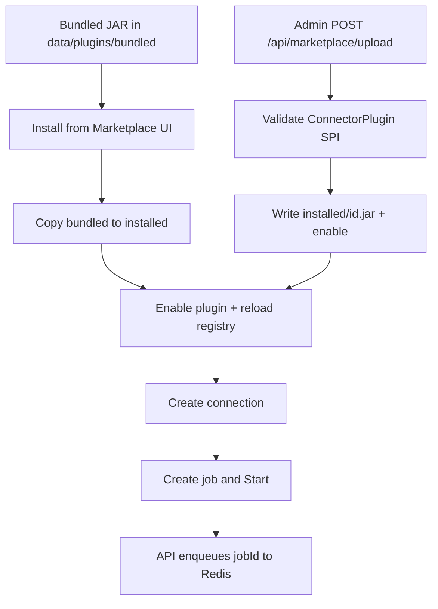

# Marketplace

Connectors are **JAR packages** under `app.plugins.dir`:

| Path | Role |
|------|------|
| `bundled/{id}.jar` | Built-in packages (e.g. PostgreSQL) always listed |
| `installed/{id}.jar` | Active plugins loaded into the registry |

**Install** copies `bundled → installed`, sets `connector_plugins.enabled=true`, and reloads the registry.
**Uninstall** disables the row and removes the installed JAR (blocked while connections reference the plugin).
**Upload** (`POST /api/marketplace/upload`, admin) validates the `ConnectorPlugin` SPI, writes `installed/{id}.jar`, and enables the catalog row.

Creating a connection requires an **installed** (enabled + loaded) connector. If none are installed, the UI sends you to the Marketplace.

## Remote / local dist install

If a connector has no bundled JAR on disk, `POST /api/marketplace/{id}/install` falls back to
`MarketplaceRemoteInstallService`, which fetches the asset named in `marketplace/catalog.json`
and verifies its SHA-256 before installing:

- `app.marketplace.mode=local` (default, offline-friendly for dev/CI) — reads
  `app.marketplace.local-dir`/`{asset}` (default `marketplace/dist/`, populated by
  `marketplace/scripts/build-dist.sh`).
- `app.marketplace.mode=remote` — downloads the asset from the latest GitHub Release of
  `app.marketplace.repo`.

`kind: TOOL` items (e.g. `lab-devtools`) skip the `connector_plugins` table entirely: install
extracts the verified zip under `data/plugins/tools/{id}/` and records the install in
`marketplace_installs`.

Future marketplace item kinds beyond `CONNECTOR`/`TOOL` can extend the same catalog.

## Install and Upload Flow

See [Adding a Connector](connectors/adding-a-connector.md).
