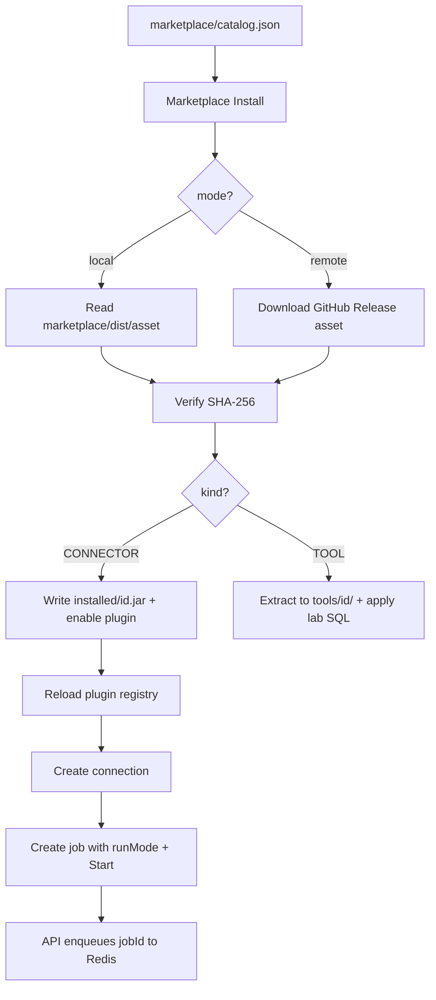

# Marketplace

Connectors are **JAR packages** loaded from `app.plugins.dir/installed/`. The main Maven build and Docker image **do not** ship or seed connector JARs into `bundled/`.

The allowlisted catalog lives in **`marketplace/catalog.json`** (repo copy; override with `MARKETPLACE_CATALOG_PATH` in dev). Each item lists a release asset name and expected SHA-256.

| Kind | Install target | Registry |
|------|----------------|----------|
| `CONNECTOR` | `installed/{id}.jar` | `connector_plugins` + `ServiceLoader` |
| `TOOL` | `data/plugins/tools/{id}/` | `marketplace_installs` only (e.g. [lab-devtools](lab-devtools.md)) |

Creating a connection requires an **installed** (enabled + loaded) connector. If none are installed, the UI sends you to the Marketplace.

## Install sources (SHA-256 verified)

`POST /api/marketplace/{id}/install` resolves the catalog item, fetches bytes, verifies SHA-256, then enables:

1. **Local dist** (default for dev/CI) — `app.marketplace.mode=local` reads `app.marketplace.local-dir/{asset}` (default `marketplace/dist/`, built by `marketplace/scripts/build-dist.sh`).
2. **GitHub Releases** — `app.marketplace.mode=remote` downloads the asset from the latest release of `app.marketplace.repo`.

There is no git-clone or arbitrary URL install path (SSRF-safe allowlist).

**Uninstall** disables the row and removes the installed artifact (blocked while connections reference a connector plugin).

**Upload** (`POST /api/marketplace/upload`, admin) validates the `ConnectorPlugin` SPI, writes `installed/{id}.jar`, and enables the catalog row — for custom connectors not in the public catalog.

## Catalog layout

```
marketplace/
├── catalog.json              # allowlisted items + asset + sha256
├── connectors/postgresql/    # connector sources → release JAR
├── plugins/lab-devtools/     # TOOL zip contents (DDL + plugin.json)
└── scripts/build-dist.sh     # populate marketplace/dist/ for local mode
```

See [marketplace/README.md](../marketplace/README.md) for building release artifacts.

## Install flow



## Remote / local dist install (detail)

If a connector has no bundled JAR on disk, install always goes through `MarketplaceRemoteInstallService`:

- `app.marketplace.mode=local` (default, offline-friendly for dev/CI) — reads
  `app.marketplace.local-dir`/`{asset}` (default `marketplace/dist/`, populated by
  `marketplace/scripts/build-dist.sh`).
- `app.marketplace.mode=remote` — downloads the asset from the latest GitHub Release of
  `app.marketplace.repo`.

`kind: TOOL` items (e.g. `lab-devtools`) skip the `connector_plugins` table entirely: install
extracts the verified zip under `data/plugins/tools/{id}/` and records the install in
`marketplace_installs`. See [Lab Dev Tools](lab-devtools.md).

Future marketplace item kinds beyond `CONNECTOR`/`TOOL` can extend the same catalog.

See [Adding a Connector](connectors/adding-a-connector.md).

[Back to Documentation Index](README.md) | [Project README on GitHub](https://github.com/shubh-am8/data-migration-tool/blob/main/README.md)
