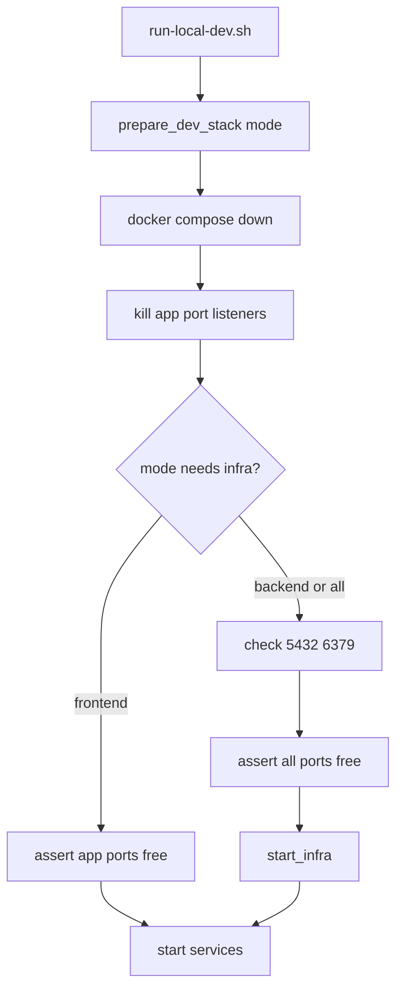

# Local Dev Port Cleanup Fix Plan

> **For agentic workers:** REQUIRED SUB-SKILL: Use [subagent-driven-development](docs/superpowers/plans/) (recommended) or executing-plans to implement task-by-task. Steps use checkbox (`- [ ]`) syntax for tracking.

**Goal:** `./run-local-dev.sh` always stops stale instances of this app's Postgres, Redis, Spring Boot services, and Next.js dev server, releases their ports, and starts fresh with zero port conflicts.

**Architecture:** Centralize port/process cleanup in [`scripts/lib/common.sh`](scripts/lib/common.sh). Add a single `prepare_dev_stack(mode)` entry point called at the top of every mode before any `start_*` calls: (1) `docker compose down` for this project's infra, (2) kill listeners on dev ports scoped to mode, (3) assert ports are free. Fix `--frontend` mode to `wait` like backend/all so the EXIT trap does not kill Next.js immediately.

**Tech Stack:** Bash, Docker Compose, `lsof`, Maven Spring Boot, Next.js dev server

## Code Review Findings (bugs driving this plan)

| Severity | Issue | Location |
|----------|-------|----------|
| **Critical** | `--frontend` starts Next.js then exits without `wait`; EXIT trap runs `cleanup_pids` and kills the server | [`scripts/run-local-dev.sh:126-128`](scripts/run-local-dev.sh) |
| **High** | No pre-start infra teardown — `start_infra` only runs `docker compose up -d`; stale/crashed containers or docker-proxy PIDs can block :5432/:6379 | [`scripts/lib/common.sh:50-56`](scripts/lib/common.sh) |
| **High** | Infra ports (5432, 6379) never cleaned; only app ports (8080, 8081, 3000) | [`scripts/run-local-dev.sh:50-58`](scripts/run-local-dev.sh) |
| **Medium** | No post-kill verification — script may proceed while a port is still bound | [`scripts/run-local-dev.sh:50-86`](scripts/run-local-dev.sh) |
| **Low** | [`docs/development.md`](docs/development.md) flow diagram omits cleanup step | docs |

## Global Constraints

- Minimal diff; reuse existing patterns in [`scripts/lib/common.sh`](scripts/lib/common.sh) and [`scripts/run-local-dev.sh`](scripts/run-local-dev.sh)
- No new dependencies
- `--keep-infra` affects **exit** cleanup only; **start** always resets this project's dev stack
- Infra port force-kill policy (user choice): kill only if listener looks like this project's Docker infra; otherwise fail with troubleshooting message (do not kill unrelated Homebrew/system Postgres)
- ponytail comments on intentional dev shortcuts (lsof+kill ceiling)
- Extend [`scripts/test/run-local-dev_test.sh`](scripts/test/run-local-dev_test.sh) (grep-based structural tests, matching existing style)

## File Structure

| File | Responsibility |
|------|----------------|
| [`scripts/lib/common.sh`](scripts/lib/common.sh) | Shared port helpers: `pids_on_port`, `kill_port_listeners`, `listener_is_project_infra`, `assert_ports_free`, enhanced `stop_infra` |
| [`scripts/run-local-dev.sh`](scripts/run-local-dev.sh) | `prepare_dev_stack(mode)` orchestration; fix frontend `wait`; call prepare before starts |
| [`scripts/test/run-local-dev_test.sh`](scripts/test/run-local-dev_test.sh) | Assert new functions wired + frontend wait + infra prep |
| [`docs/development.md`](docs/development.md) | Document pre-start cleanup behavior |

## Port Map by Mode



| Mode | Infra down | Ports cleared | Ports verified |
|------|------------|---------------|----------------|
| `frontend` | no | 3000 | 3000 |
| `backend` | yes | 5432, 6379, 8080, 8081 | same |
| `all` | yes | 5432, 6379, 8080, 8081, 3000 | same |

---

### Task 1: Port helper functions in common.sh

**Files:**
- Modify: [`scripts/lib/common.sh`](scripts/lib/common.sh)
- Test: [`scripts/test/run-local-dev_test.sh`](scripts/test/run-local-dev_test.sh)

**Interfaces:**
- Consumes: `COMPOSE_FILE`, `ROOT_DIR` (existing)
- Produces:
  - `pids_on_port(port) -> newline-separated PIDs or empty`
  - `kill_port_listeners(port...) -> void` (SIGTERM, sleep 1, SIGKILL fallback)
  - `listener_is_project_infra(port, pid) -> exit 0 if safe to kill`
  - `assert_ports_free(port...) -> exit 1 with message if any port still bound`
  - `stop_infra()` enhanced with `--remove-orphans`

- [ ] **Step 1: Write failing structural test**

Add to [`scripts/test/run-local-dev_test.sh`](scripts/test/run-local-dev_test.sh):

```bash
for fn in pids_on_port kill_port_listeners listener_is_project_infra assert_ports_free; do
  grep -q "${fn}()" "${ROOT}/scripts/lib/common.sh" || fail "common.sh must define ${fn}"
done
pass "common.sh defines port helper functions"
```

Run: `bash scripts/test/run-local-dev_test.sh`
Expected: FAIL (functions not defined yet)

- [ ] **Step 2: Implement helpers in common.sh**

```bash
pids_on_port() {
  local port=$1
  lsof -ti :"${port}" 2>/dev/null | sort -u || true
}

kill_port_listeners() {
  local port pid pids remaining
  for port in "$@"; do
    pids="$(pids_on_port "${port}")"
    [[ -z "${pids}" ]] && continue
    echo "Stopping listeners on :${port}..."
    while read -r pid; do
      [[ -n "${pid}" ]] && kill "${pid}" 2>/dev/null || true
    done <<< "${pids}"
    sleep 1
    remaining="$(pids_on_port "${port}")"
    if [[ -n "${remaining}" ]]; then
      echo "Force-stopping stubborn listeners on :${port}: ${remaining}"
      while read -r pid; do
        [[ -n "${pid}" ]] && kill -9 "${pid}" 2>/dev/null || true
      done <<< "${remaining}"
    fi
  done
}

listener_is_project_infra() {
  local port=$1 pid=$2
  local comm args
  comm="$(ps -p "${pid}" -o comm= 2>/dev/null || true)"
  args="$(ps -p "${pid}" -o args= 2>/dev/null || true)"

  # ponytail: name-based heuristic for local dev; upgrade path = docker inspect by published port
  case "${comm}" in
    *docker*|*com.docker*|*OrbStack*|*vpnkit*) return 0 ;;
  esac

  if docker compose -f "${COMPOSE_FILE}" ps -q 2>/dev/null | grep -q .; then
    return 0
  fi

  case "${port}" in
    5432) [[ "${args}" == *postgres* && "${args}" == *migration* ]] && return 0 ;;
    6379) [[ "${args}" == *redis* ]] && return 0 ;;
  esac

  return 1
}

assert_ports_free() {
  local port pids
  for port in "$@"; do
    pids="$(pids_on_port "${port}")"
    if [[ -n "${pids}" ]]; then
      echo "Port :${port} is still in use (PIDs: ${pids})."
      echo "Stop the conflicting process or see docs/development.md#troubleshooting"
      return 1
    fi
  done
}

stop_infra() {
  echo "Stopping Postgres + Redis..."
  docker compose -f "${COMPOSE_FILE}" down --remove-orphans
}
```

- [ ] **Step 3: Re-run test**

Run: `bash scripts/test/run-local-dev_test.sh`
Expected: PASS for new assertions (may still fail later tasks' assertions)

- [ ] **Step 4: Commit**

```bash
git add scripts/lib/common.sh scripts/test/run-local-dev_test.sh
git commit -m "feat: add shared dev port cleanup helpers"
```

---

### Task 2: prepare_dev_stack + infra-safe cleanup

**Files:**
- Modify: [`scripts/run-local-dev.sh`](scripts/run-local-dev.sh)
- Modify: [`scripts/lib/common.sh`](scripts/lib/common.sh) (if `clear_stale_infra_ports` lives here)
- Test: [`scripts/test/run-local-dev_test.sh`](scripts/test/run-local-dev_test.sh)

**Interfaces:**
- Consumes: Task 1 helpers
- Produces: `prepare_dev_stack(mode)` where `mode` is `frontend|backend|all`

- [ ] **Step 1: Write failing structural tests**

```bash
grep -q 'prepare_dev_stack()' "${ROOT}/scripts/run-local-dev.sh" || fail "run-local-dev.sh must define prepare_dev_stack"
grep -q 'prepare_dev_stack "${MODE}"' "${ROOT}/scripts/run-local-dev.sh" || fail "main must call prepare_dev_stack before starts"
grep -q 'stop_infra' "${ROOT}/scripts/run-local-dev.sh" || fail "prepare must stop infra for backend/all"
pass "prepare_dev_stack wired in main flow"
```

Run: `bash scripts/test/run-local-dev_test.sh`
Expected: FAIL

- [ ] **Step 2: Implement prepare_dev_stack in run-local-dev.sh**

Replace inline `clear_stale_dev_ports_for_mode` with:

```bash
clear_stale_infra_ports() {
  local port pid
  for port in 5432 6379; do
    local pids
    pids="$(pids_on_port "${port}")"
    [[ -z "${pids}" ]] && continue

    local safe=true
    while read -r pid; do
      [[ -z "${pid}" ]] && continue
      if ! listener_is_project_infra "${port}" "${pid}"; then
        safe=false
        echo "Refusing to kill non-project listener on :${port} (PID ${pid})."
      fi
    done <<< "${pids}"

    if [[ "${safe}" == "true" ]]; then
      kill_port_listeners "${port}"
    else
      assert_ports_free "${port}"  # prints troubleshooting + exits 1
    fi
  done
}

prepare_dev_stack() {
  local mode=$1
  case "${mode}" in
    frontend)
      kill_port_listeners 3000
      assert_ports_free 3000
      ;;
    backend)
      stop_infra
      clear_stale_infra_ports
      kill_port_listeners 8080 8081
      assert_ports_free 5432 6379 8080 8081
      ;;
    all)
      stop_infra
      clear_stale_infra_ports
      kill_port_listeners 8080 8081 3000
      assert_ports_free 5432 6379 8080 8081 3000
      ;;
  esac
}
```

- [ ] **Step 3: Rewire main() — prepare first, remove duplicate cleanup calls**

```bash
main() {
  parse_args "$@"
  load_env
  ensure_dev_dir
  trap on_exit INT TERM EXIT
  prepare_dev_stack "${MODE}"

  case "${MODE}" in
    frontend)
      start_frontend
      echo "Frontend running: http://localhost:3000"
      wait
      ;;
    backend)
      start_infra
      build_backend
      start_api
      start_worker
      echo "Backend running. API: http://localhost:8080  Worker: http://localhost:8081"
      wait
      ;;
    all)
      start_infra
      build_backend
      start_api
      start_worker
      start_frontend
      echo "Full stack running:"
      echo "  Web:    http://localhost:3000"
      echo "  API:    http://localhost:8080"
      echo "  Worker: http://localhost:8081"
      wait
      ;;
  esac
}
```

Delete old `clear_stale_dev_ports_for_mode` function entirely.

- [ ] **Step 4: Run tests**

Run: `bash scripts/test/run-local-dev_test.sh`
Expected: All PASS

- [ ] **Step 5: Commit**

```bash
git add scripts/run-local-dev.sh scripts/test/run-local-dev_test.sh
git commit -m "fix: reset dev stack and ports before local startup"
```

---

### Task 3: Update tests for removed function + frontend wait

**Files:**
- Modify: [`scripts/test/run-local-dev_test.sh`](scripts/test/run-local-dev_test.sh)

- [ ] **Step 1: Replace stale grep for old function name**

Remove assertion for `clear_stale_dev_ports_for_mode "frontend"`. Add:

```bash
grep -q 'prepare_dev_stack "frontend"' "${ROOT}/scripts/run-local-dev.sh" || fail "frontend mode must prepare stack"
grep -A5 'frontend)' "${ROOT}/scripts/run-local-dev.sh" | grep -q 'wait' || fail "frontend mode must wait for dev server"
pass "frontend mode prepares stack and waits"
```

- [ ] **Step 2: Run tests**

Run: `bash scripts/test/run-local-dev_test.sh`
Expected: All PASS

- [ ] **Step 3: Commit**

```bash
git add scripts/test/run-local-dev_test.sh
git commit -m "test: cover prepare_dev_stack and frontend wait fix"
```

---

### Task 4: Docs + manual verification

**Files:**
- Modify: [`docs/development.md`](docs/development.md)

- [ ] **Step 1: Update Dev Script Flow and Troubleshooting**

Add bullet under **Dev Script Flow**: "On every start, tears down this project's Docker infra and kills stale listeners on dev ports before starting."

Update troubleshooting for port conflicts:

```markdown
- **Port already in use (8080/8081/3000):** Re-run `./run-local-dev.sh` — it clears stale listeners automatically
- **Port 5432/6379 blocked by non-project process:** Script refuses to kill unrelated Postgres/Redis; stop the other service or change compose port mapping
```

- [ ] **Step 2: Manual verification checklist**

```bash
# Terminal 1: start full stack
./run-local-dev.sh

# Terminal 2: confirm ports
lsof -i :3000 -i :8080 -i :8081 -i :5432 -i :6379

# Ctrl+C Terminal 1, restart — should succeed with no EADDRINUSE
./run-local-dev.sh

# Frontend-only regression (was broken)
./run-local-dev.sh --frontend
# curl -sf http://localhost:3000 >/dev/null && echo OK
```

Expected: second start succeeds; `--frontend` stays running until Ctrl+C

- [ ] **Step 3: Commit**

```bash
git add docs/development.md
git commit -m "docs: document dev stack reset on startup"
```

---

## Execution Handoff

After plan approval, execute with **subagent-driven-development**:
1. Fresh implementer subagent per task (cheap model for Tasks 1–3; standard for Task 4 verification)
2. Task review after each task via `scripts/review-package`
3. Final whole-branch review before merge

**Plan will be saved to:** [`docs/superpowers/plans/2026-07-20-local-dev-port-cleanup.md`](docs/superpowers/plans/2026-07-20-local-dev-port-cleanup.md) on execution.
