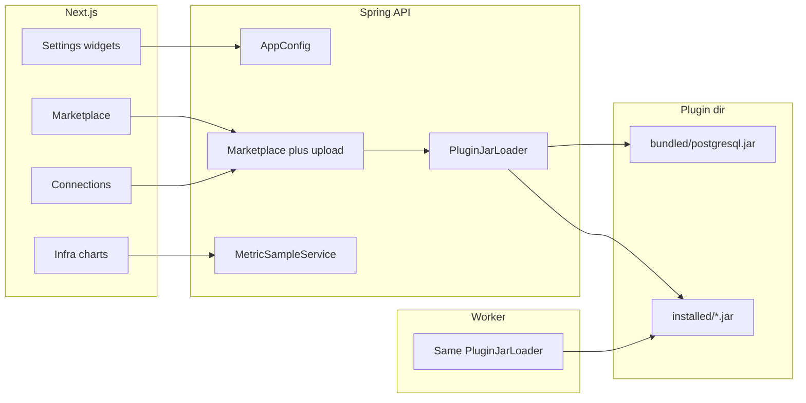

# Platform UX + Connector JAR Marketplace Plan

> **For agentic workers:** REQUIRED SUB-SKILL: Use `superpowers:subagent-driven-development` (recommended) or `superpowers:executing-plans` to implement task-by-task. After approval, also save a copy to `docs/superpowers/plans/2026-07-20-ux-marketplace-plugins.md`.

**Goal:** Bring Settings, Connections, Marketplace, Infra, Users, and shared UI up to product standards; ship connectors as installable JARs (built-in PostgreSQL always listed, manually installed; users can upload their own) with docs; persist IP whitelist as labeled entries; keep a 3-hour in-memory metrics window with charts and no unbounded growth.

**Architecture:** Next.js stays a thin authenticated UI over Spring. Settings gains typed field widgets (Select, IP entry editor, reveal/hide). Connectors move from “always on classpath” to a **plugin directory** shared by API and Worker: bundled built-in JARs + uploaded JARs loaded via isolated `URLClassLoader` + `ServiceLoader`. Marketplace lists catalog rows (built-ins always visible); **Install** copies/activates the JAR and sets `enabled=true`; connections require an enabled+loaded plugin. Metrics sampler writes into a fixed-capacity ring buffer (~3h) exposed to dashboard/infra charts.

**Tech Stack:** Next.js 16 + shadcn/ui (Field/Select/Table/Chart/Empty/Badge) + Inter; Spring Boot 3.3; existing `connector-sdk` SPI; filesystem plugin dir; Micrometer gauges.

## Locked decisions

- **Connectors (user 1A+):** Separate JARs. PostgreSQL is an **inbuilt** marketplace item (always listed) but **not active until manually installed**. Users can **upload** custom connector JARs. Docs for building connectors. Phase 1: full install/uninstall/upload control; **at least one connector must be installed** before adding connections.
- **IP whitelist (user 2A):** Persist `[{"label":"Office VPN","ip":"203.0.113.9"}]`; filter matches on `.ip` (CIDR still supported via existing `IpMatcher`).
- **Font:** Inter (`next/font/google`) as standard UI sans; fix broken `--font-sans` wiring.
- **YAGNI deferred:** Multi-tenant plugin stores, signed JAR verification beyond basic SPI check, Connector Builder UI (docs only for authoring).

## Global constraints

- Reuse shadcn + existing `AppLoader` / `notify` / `PaginationBar` / pill `Button` variants before inventing new primitives
- No new deps unless unavoidable (shadcn add OK; Inter via `next/font`)
- Admin-only for marketplace upload, infra metrics, users
- Every list remains paginated (`page`/`size` 10–500)
- Plugin load must work on **API and Worker** (today Worker hardcodes `new PostgresqlConnectorPlugin()` in [`JobQueueConsumer.java`](services/worker/src/main/java/com/migration/queue/JobQueueConsumer.java) — that must go)
- Ring buffer capacity is fixed; no unbounded lists (no memory leak)
- Update [`.cursor/rules/ui-patterns.mdc`](.cursor/rules/ui-patterns.mdc) + connector docs
- `ponytail:` comment any intentional ceiling (e.g. unload requires process restart)

## File map (high level)

| Area | Primary files |
|------|----------------|
| Fonts | [`apps/web/src/app/layout.tsx`](apps/web/src/app/layout.tsx), [`apps/web/src/app/globals.css`](apps/web/src/app/globals.css) |
| Settings UX | [`ConfigEditor.tsx`](apps/web/src/components/shared/ConfigEditor.tsx), new `IpWhitelistEditor.tsx`, [`settings/page.tsx`](apps/web/src/app/settings/page.tsx), [`RuntimeConfigCatalog.java`](services/api/src/main/java/com/migration/config/RuntimeConfigCatalog.java), [`IpWhitelistFilter.java`](services/api/src/main/java/com/migration/security/IpWhitelistFilter.java) |
| Shared table | new `apps/web/src/components/shared/DataTable.tsx` (+ skeleton), migrate users/jobs/connections/workers |
| Connections gate | [`ConnectionService.java`](services/api/src/main/java/com/migration/connectors/ConnectionService.java), connections pages + form |
| Plugin JAR runtime | new `PluginJarLoader` / `PluginDirectory`, enhance [`ConnectorPluginRegistry`](packages/connector-sdk/src/main/java/com/migration/connectors/ConnectorPluginRegistry.java), API+Worker wiring, remove PG compile dependency from services |
| Marketplace | [`MarketplaceController`](services/api/src/main/java/com/migration/connectors/MarketplaceController.java), marketplace client + filters + upload |
| Metrics 3h | new `MetricSampleService`, [`DashboardController`](services/api/src/main/java/com/migration/dashboard/DashboardController.java), [`InfraController`](services/api/src/main/java/com/migration/admin/InfraController.java), infra/dashboard charts |
| Users avatars | [`users/page.tsx`](apps/web/src/app/users/page.tsx), [`UserMenu.tsx`](apps/web/src/components/layout/UserMenu.tsx) |
| Docs/rules | [`docs/connectors/adding-a-connector.md`](docs/connectors/adding-a-connector.md), [`docs/marketplace.md`](docs/marketplace.md), ui-patterns rule |

---

### Task 1: Standard font (Inter) + token fix

**Files:** `layout.tsx`, `globals.css`

- Replace Geist with Inter via `next/font/google` (`variable: "--font-sans"`).
- Fix `@theme inline { --font-sans: var(--font-geist-sans) }` circular bug → `--font-sans: var(--font-sans)` must resolve to the Inter variable (set `--font-sans` from next/font, map theme to it once).
- Keep a mono stack (`ui-monospace` / Geist Mono optional) for terminals only.

**Verify:** UI body text renders Inter; no circular CSS var.

---

### Task 2: Settings — mode Select, labeled IP editor, hide when OPEN

**Files:** `ConfigEditor.tsx`, new `IpWhitelistEditor.tsx`, `settings/page.tsx`, tests

- `ip_whitelist_mode`: shadcn `Select` with `OPEN` | `RESTRICTED` (not free text).
- When mode is `OPEN` (or blank): **do not render** IP whitelist editor.
- When `RESTRICTED`: render row editor — **Label** + **IP/CIDR** + Add/Remove; serialize to JSON array of objects on save.
- Human labels for all catalog keys; FieldGroup + Field composition; pill badges for source (`ENV`/`DB`/`DEFAULT`).

**Backend companion (same task or Task 3):** validator accepts object array; migrate existing `["1.2.3.4"]` string arrays on read (treat as `{label:"",ip:"..."}`).

---

### Task 3: IP whitelist backend — labeled JSON + filter

**Files:** `IpWhitelistFilter.java`, `IpMatcher` tests, `RuntimeConfigCatalog` validator, Flyway note / migration helper in service

- Parse whitelist as `List<{label,ip}>`; match client IP against `ip` field only.
- Backward compatible: if element is a JSON string, treat as IP with empty label.
- Unit tests: OPEN hides enforcement; RESTRICTED matches labeled entries; legacy string array still works.

---

### Task 4: Secret Show/Hide + mask Google client ID

**Files:** `ConfigEditor.tsx`, `settings/page.tsx`, `RuntimeConfigCatalog.java` (`google_client_id` → sensitive), `AppConfigService` mask/reveal

- Show: reveal endpoint (existing).
- Hide: set local `masked: true` and value `"********"` **without** calling reveal again (fix the bug).
- Mark `google_client_id` sensitive like secret (mask in list; reveal on Show).
- Prefer `type="password"` while masked for sensitive fields.

---

### Task 5: Shared `DataTable` + skeleton; migrate list pages

**Files:** new `DataTable.tsx`, `DataTableSkeleton.tsx`; migrate [`users`](apps/web/src/app/users/page.tsx), [`jobs`](apps/web/src/app/jobs/page.tsx), [`connections`](apps/web/src/app/connections/page.tsx), [`workers`](apps/web/src/app/workers/page.tsx)

- Columns API: `{ id, header, cell, className? }[]` + `PaginationBar` footer.
- Loading → skeleton table (shadcn `Skeleton` rows), not spinner-only.
- Status cells use colorful pill `Badge` / `Button` variants.
- Empty → shadcn `Empty` with CTA slot.

Update ui-patterns rule: “lists use DataTable + PaginationBar + AppLoader/Skeleton”.

---

### Task 6: Plugin directory + JAR loader (API + Worker)

**Files:** new loader under `packages/connector-sdk` or `services/api` shared module; Worker uses same; remove hardcoded PG in `JobQueueConsumer`

**Design (concrete):**
- Config: `app.plugins.dir` (default `./data/plugins`) with subdirs `bundled/` and `installed/`.
- Build `connectors/postgresql` as a deployable JAR artifact; on API/worker start, ensure `bundled/postgresql.jar` exists (copy from known build path or image layer).
- **Do not** depend on `postgresql-connector` as a compile dependency of API/Worker for runtime discovery (keep SDK only).
- `PluginJarLoader`: for each `installed/*.jar`, create `URLClassLoader` (parent = app classloader), `ServiceLoader.load(ConnectorPlugin.class, cl)`, register by `id()`.
- Registry becomes mutable: `loadInstalled()`, `register(plugin)`, `unregister(id)` (ponytail: unload may leave classes until restart; document).
- Seed `connector_plugins` catalog row for `postgresql` with `enabled=false`, `builtin=true` (Flyway).

**Tests:** load a test stub JAR / in-memory plugin list; require fails when not installed.

---

### Task 7: Marketplace install / uninstall / upload + filters

**Files:** `MarketplaceController`, marketplace client, `ConnectorCard`, docs

- List always includes built-ins (even if not installed) + uploaded plugins.
- **Install** (builtin): copy `bundled/{id}.jar` → `installed/{id}.jar`, set `enabled=true`, reload registry.
- **Uninstall:** `enabled=false`, delete/rename installed JAR (block if connections reference plugin).
- **Upload:** `POST /api/marketplace/upload` multipart; validate SPI + unique id; write JAR; enable; reload. Admin-only.
- UI: search box; filter chips **All | Installed | Available**; category tab **Connectors** (future-ready for other marketplace item types via `kind` field default `CONNECTOR`).
- Card: Install / Uninstall / “Add connection” only when installed; “Build your own” card → docs link.
- Update [`docs/connectors/adding-a-connector.md`](docs/connectors/adding-a-connector.md) for SDK + packaging JAR + upload path; [`docs/marketplace.md`](docs/marketplace.md).

---

### Task 8: Connections — connector-first, gate on installed

**Files:** `ConnectionService`, connections list/new form, Empty states

- `create`/`update`: reject unless `connector_plugins.enabled` **and** registry has plugin (HTTP 400 with clear message).
- Connections page: group or filter **by connector**; primary CTA “Add connection” opens connector picker of **installed only**.
- If **zero** installed connectors: Empty state — “Install a connector from Marketplace” button (no hard-coded `?plugin=postgresql`).
- Connection form: dynamic fields from `configSchema()`; pool min/max kept.

---

### Task 9: Infra health badge + 3h metrics ring + charts

**Files:** `MetricSampleService`, Dashboard/Infra controllers + pages

- Fix health display: map Actuator health to `UP`/`DOWN`/`UNKNOWN` string — never `SystemHealth@…`; badge `truncate` / `max-w-full`.
- Sampler every 30s: API CPU, JVM mem, Hikari active/max, worker online count (and worker CPU if available via aggregator).
- Ring buffer capacity = `3h / 30s = 360` samples; overwrite oldest; single scheduled task; no extra threads per sample.
- Expose `samples[]` on `/api/dashboard/stats` and `/api/admin/infra`.
- UI: shadcn Chart line (CPU/mem/pool) on Infra (and reuse on Dashboard if samples present).

**Test:** buffer never exceeds capacity after >360 offers; GC-friendly (no retained classloaders).

---

### Task 10: Users table avatars + profile visibility

**Files:** `users/page.tsx`, ensure `pictureUrl` on `AuthUser` / admin DTO (already in `UserService.toDto`)

- Avatar column (round `Avatar` + fallback initials); show email, name, online/revoked pill badges, last login/seen.
- Confirm shell `UserMenu` already shows Google picture.

---

### Task 11: Cursor rule + CHANGELOG hygiene

**Files:** `.cursor/rules/ui-patterns.mdc`, optionally new `.cursor/rules/connectors-marketplace.mdc`, `CHANGELOG.md`

- Document: DataTable, Settings field widgets, marketplace install gate, plugin JAR dir, Inter font, notify/AppLoader.
- Short CHANGELOG entry for 0.7.0 UX + plugins.

---

## Execution order

`1 → 2 → 3 → 4 → 5 → 6 → 7 → 8 → 9 → 10 → 11`  
(Fonts/settings first for quick UX wins; JAR loader before marketplace upload and connection gate; metrics after infra badge fix.)

## Code review backlog addressed by this plan

| Finding | Task |
|---------|------|
| Hide secret no-op | 4 |
| Connections bypass marketplace | 6–8 |
| Circular font token | 1 |
| Raw IP mode / `[]` UX | 2–3 |
| Infra `SystemHealth@` badge | 9 |
| Missing charts / samples | 9 |
| Users ignore `pictureUrl` | 10 |
| No shared DataTable | 5 |
| PG hardcoded in worker | 6 |

## Out of scope

- Connector Builder no-code UI
- Cryptographic JAR signing / sandbox beyond SPI + admin-only upload
- Redis/MySQL connector packages themselves (docs say “same as PG JAR”)
